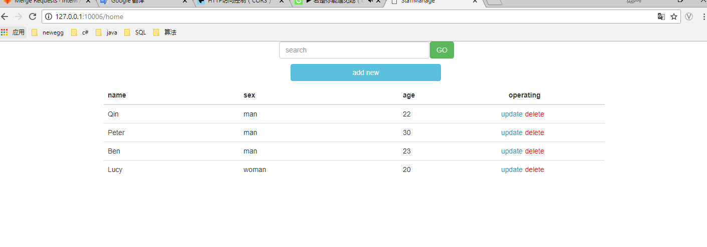
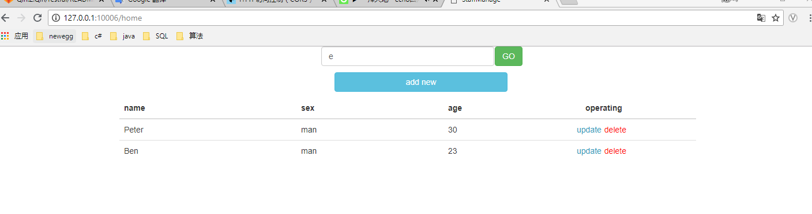
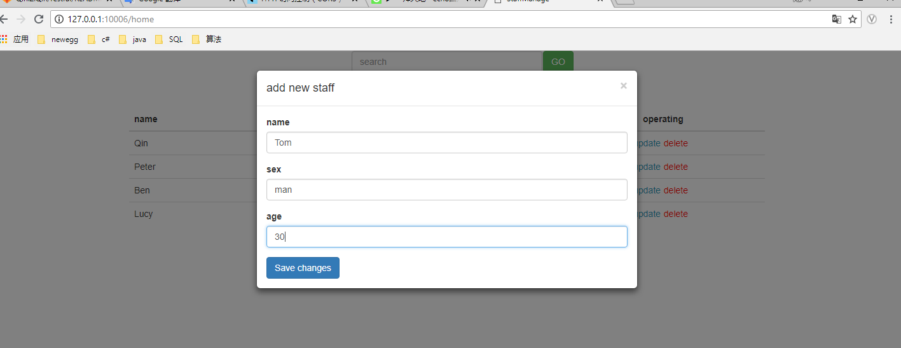
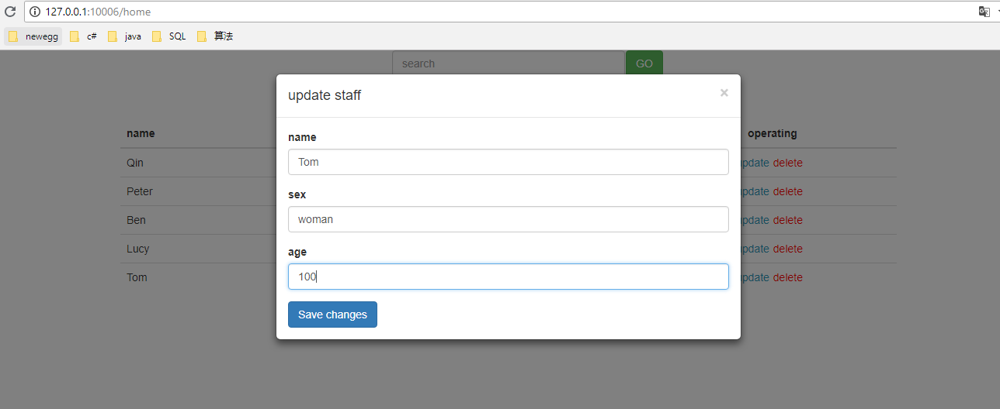
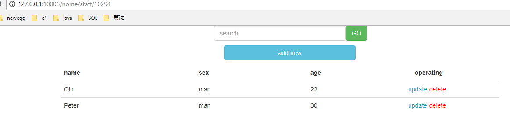
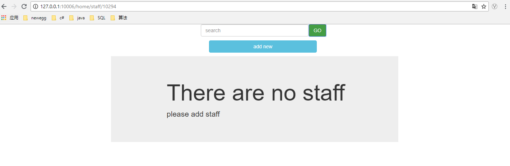

## 简介
使用socket解析http，做成一个微型的tomcat 
使用restful API风格实现员工的CRUD操作

## 程序入口
* 启动Server类即可

## 使用流程	
* 打开浏览器访问'127.0.0.0:10006/login'
* 使用默认用户名 1 默认密码 1进行登录（没有做权限验证，所以不登录直接访问主页也可以的= =.）
* 或者新注册一个账号

## 其他
* 搜索是模糊搜索
* 搜索框如果不输入搜索条件即表示全部查询
* 使用了两种方式实现非get/post请求
	* 1）使用ajax请求，指定type，使用这种方式时浏览器会有两次请求 预请求得到服务端支持的请求类型
	* 2）添加一个_method隐藏表单域，指定请求类型，服务端拿到该值再改造请求行，这个是模仿的springmvc
* 使用自定义注解映射请求路径，主要在controller包下
	
## 图片
主页
 
搜索
 
添加
 
 
更新
 
 
删除直接点击delete，这个不好截图。
 
 

